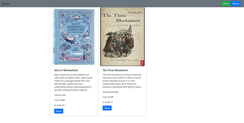
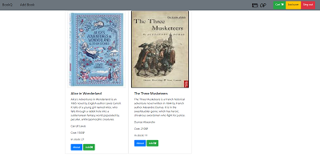
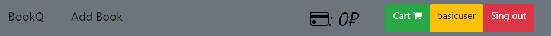
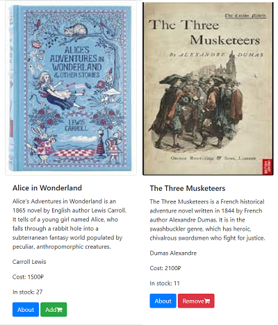
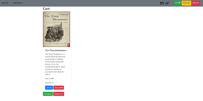
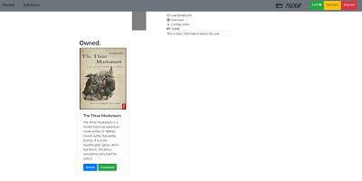
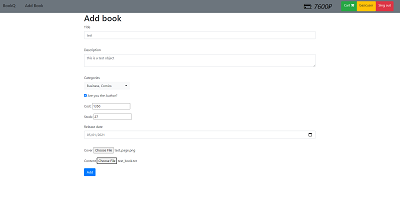
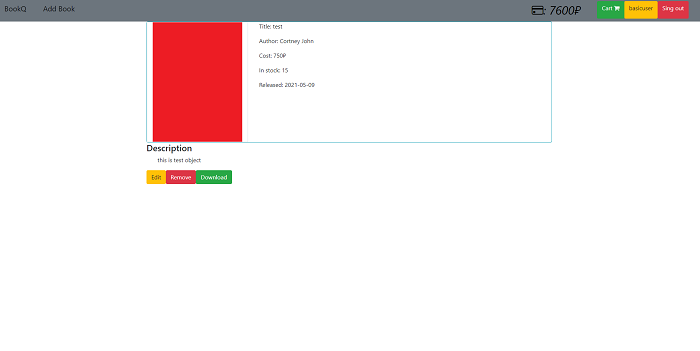

<h1>BookQ</h1>

## Описание
Сайт библиотека разработанная на python при помощи мини фреймоврка flask. Проект предназначен для
покупки и продажи книг различных жанров. После регистрации, у вас появится возможность купить или 
выставить свою собственную книгу для продажи.

## Реализация
### Главная страница
На главной странице отображены все книги выставленные на продажу 
Сверху на панели регистрации есть две кнопки для регистрации и входа в профиль 
 
Если вы уже авторизованны то у вас появится доступ к дополнительному функционалу 
 
В меню навигации будут доступны следующие функции 
кнопка добавления книги **Add Book** 
Кнопка пополнения баланса 
Зеленая кнопка для просмотра корзины 
Желтая кнопка для просмотра своего профиля 
Красная кнопка для выхода из профиля 
 
На карточках книг появится кнопка для добавления или удаления книги из корзины

### Корзина
В корзине отображаются все книги которые пользователь добавляет туда. 
Вы можете убрать книги по одному или все разом. 
Еще у пользователя есть возможность купить все книги в корзине, если у вас достаточно средств 
 
 
### Профиль пользователя
На странице пользователя отображена информация о самом пользователе и также купленные им книги. 
 
В карточке купленных книг есть кнопка **Download** которая позволяет вам скачать купленную книгу 

### Добавление книги
Если авторизоваться и нажать на кнопку **Add Book** на панели навигации,
то вас перенаправить на форму добавления книги. 
 
После добавления книги она отобразится у вас на главной странице и будет считаться купленной книгой

### Страница книги
 
На странице книги есть информация о самой книге. Также в зависимости от того являетесь ли вы автором книги
или куплена ли эта книга, появятся дополнительные кнопки под карточкой книги 
Кнопка **Edit** позволить вам редактировать вашу книгу 
Кнопка **Remove** удалит книгу из сайта 
Кнопка **Download** позволить вам ее скачать 

## Запуск проекта
Чтобы запустить проект, нужно установить все модули из requirements.txt
и запустить файл **main.py** который находится в корневой папке
После чего перейти по адресу **http://127.0.0.1:5000** в любом браузере
